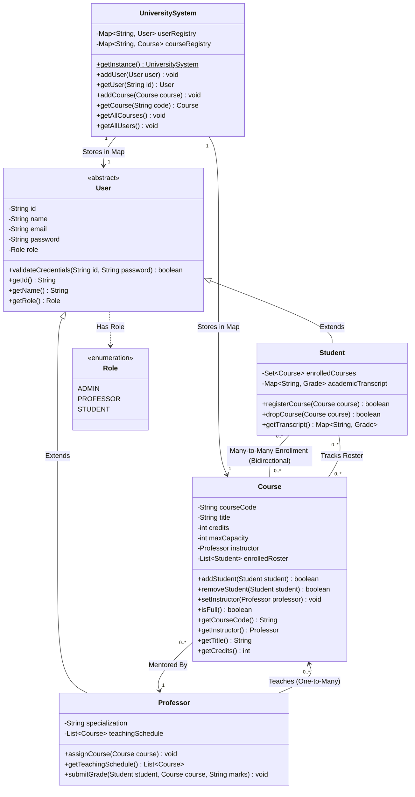

# In-Memory CLI University Management System

A lightweight, terminal-based University Management System built purely in Java. This application simulates core institutional workflows—including role-based access for Administrators, Professors, and Students—using strict object-oriented design and Java Collections for state management without requiring external files or databases.

## 🗺️ System Architecture

The application is structured into modular layers to maintain a clean separation of concerns, ensuring high maintainability and robust execution:

- **`model/` (Data Entities):** Contains domain blueprints leveraging object inheritance (e.g., an abstract `User` base class extended by `Student` and `Professor`) along with complex, memory-linked associations like the many-to-many relationship between students and courses.
    
- **`registry/` (In-Memory Database Layer):** Implements a centralized, thread-safe data context using the **Singleton Pattern**. It acts as the local system cache, organizing data using fast lookup maps (`Map<String, User>` and `Map<String, Course>`).
    
- **`cli/` (Presentation & I/O Validation Layer):** Controls terminal routing matrices, display menus, and input stream reading. It features a hardened parser mechanism that traps data mismatch anomalies defensively to prevent crash scenarios.




## 🛠️ Features Implemented

### 1. Robust I/O Input Shielding

- **Type Guarding:** Custom validation interceptors catch input conversion bugs (such as typing characters into menu items expecting integers) via structured exception shielding.
    
- **Buffer Cleaning:** Gracefully empties out mismatched token entries to prevent terminal input lockups.
    

### 2. Administrator Controls

- **Account Generation:** Programmatic provisioning of sequential ID records for staff and student entities.
    
- **Curriculum Mapping:** Creation of distinct courses mapped to active instructional personnel indices.
    

### 3. Faculty Utilities

- **Roster Introspection:** Real-time visibility into dynamic course student registration sequences.
    
- **Evaluation Engine:** Direct modification capabilities for assigning continuous evaluation records or letter grades to registered users.
    

### 4. Student Portals

- **Capacity-Aware Registration:** Real-time query options for registration lists that actively respect maximum seat restrictions.
    
- **Transcript Compilation:** Instant calculation and summary view of active enrollments alongside finalized evaluations.
    

## 🗃️ Project Structure

```
university-management-system
    ├── src
    │   ├── com
    │   │   └── university
    │   │       └── service
    │   │           ├── AdminServiceTest.java
    │   │           ├── ProfessorServiceTest.java
    │   │           ├── StudentServiceTest.java
    │   │           └── UniversityRegistryTest.java
    │   └── main
    │       └── java
    │           └── com
    │               └── university
    │                   ├── cli
    │                   │   ├── ConsoleManager.java
    │                   │   └── SystemFunctions.java
    │                   ├── Main.java
    │                   ├── model
    │                   │   ├── Admin.java
    │                   │   ├── Course.java
    │                   │   ├── Professor.java
    │                   │   ├── Role.java
    │                   │   ├── Student.java
    │                   │   └── User.java
    │                   └── registry
    │                       └── RegistrySystem.java
    └── university-management-system.iml
```
